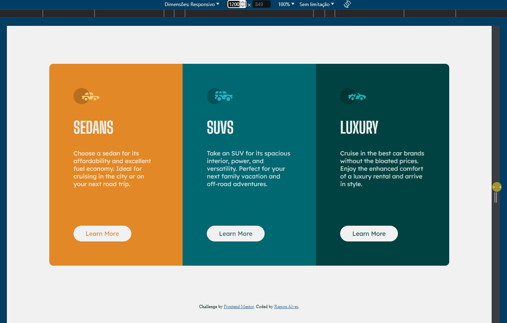

# Frontend Mentor - 3-column preview card component solution

This is a solution to the [3-column preview card component challenge on Frontend Mentor](https://www.frontendmentor.io/challenges/3column-preview-card-component-pH92eAR2-). Frontend Mentor challenges help you improve your coding skills by building realistic projects. 


## Overview

### The challenge

Users should be able to:

- View the optimal layout depending on their device's screen size
- See hover states for interactive elements

## Screenshot

- ### Desktop


- ### Mobile


- ### Responsivity



### Links

- Solution URL: [Frontend Mentor](https://www.frontendmentor.io/solutions/-html5-e-css-10-newbie-3-column-preview-card-component-naBQhNaz_9)
- Live Site URL: [Live Site](https://ramon-alvez.github.io/Frontend-Mentor-HTML-CSS-Newbie-3-Column-Preview-Card)

## My process

### Built with

- Semantic HTML5 markup
- CSS custom properties
- Flexbox


### What I learned

Well, on this site I took advantage of the fact that it was simple to do and tried a new style of organizing things in CSS, and also making the page more accessible with the help of the chat gpt, that guided me whether my changes were good semantically and accessible.

(I used him to teach me how the tags worked, and also see if the way I used them was correct)

Here are the codes below:


- Meta tags on Head

```html

  <meta name="description" content="Frontend Mentor 3-column preview card solution: Explore a responsive and accessible design for showcasing product information with this design solution.">
  <meta name="keywords" content="Frontend Mentor, Frontend web development, html, css, card component, preview card, challenge, responsive preview card design, card design, product card, responsive layout, accessible">

```


- Link accessibility with title and aria-labels

```html

  <a class="button sedansButton" title="Learn more about Sedans"
        href="#" aria-label="Sedan cars info">Learn More</a>
```


### Continued development

My current goal is to finish all the FrontEnd Mentor challenges, to train and learn in the process.


## Author

- GitHub - [Ramon Alvez](https://github.com/Ramon-Alvez)
- Frontend Mentor - [@Ramon Alvez](https://www.frontendmentor.io/profile/Ramon-Alvez)
- LinkedIn - [@Ramon Alvez](https://www.linkedin.com/in/ramon-alvez/)
